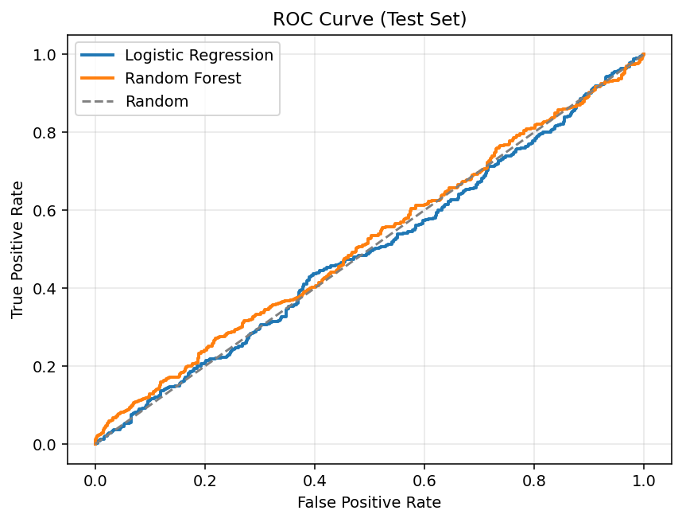
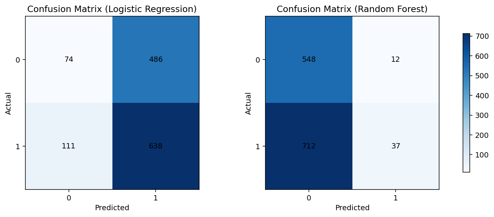
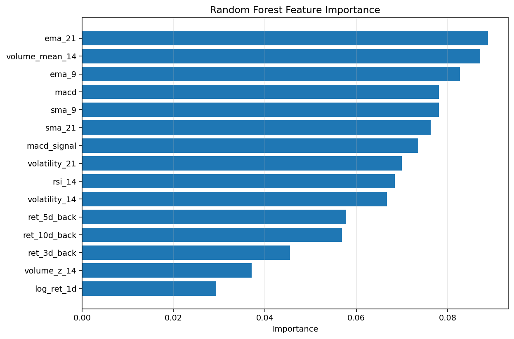

# NVDA 3-Day Return Direction Prediction

This repository is a reproducible Python data science pipeline that predicts whether **NVDA** will have a positive 3-day forward return (`y_3d`) using technical indicators, then evaluates both classification quality and strategy-level trading performance.

## Objective

- **Ticker:** NVDA (Yahoo Finance via `yfinance`)
- **Target:** `y_3d = 1` if `(Close[t+3] / Close[t] - 1) > 0`, else `0`
- **Models:**
  - Logistic Regression (`StandardScaler` + `LogisticRegression`)
  - Random Forest (`RandomForestClassifier`)
- **Baselines:**
  - Random 50/50 classifier baseline (Monte Carlo)
  - Buy-and-hold return baseline
- **Backtest strategy:** Daily signal strategy where `position[t] = prediction[t]`, and PnL uses `next_day_return[t]`

## Leakage Controls

- Forward target built with explicit forward shift.
- Features use only information available up to timestamp `t`.
- Chronological split only: earliest 80% train / latest 20% test.
- Scaling fit on train only inside scikit-learn pipeline.
- Rolling NaNs dropped after feature creation.

## Repository Layout

```text
.
├── README.md
├── PI5_QUICKSTART.md
├── requirements.txt
├── run_all.py
├── run_signal.py
├── bundle_pi5.py
├── data
├── models
├── notebooks
├── reports
├── signals
└── src
```

## Setup

```bash
pip install -r requirements.txt
```

## Run End-to-End Research Pipeline

```bash
python run_all.py
```

This single command runs:

1. Data download/cache
2. Feature engineering
3. Time-based split
4. Model training
5. Classification evaluation + plots
6. Trading backtest + equity curve
7. Report generation (`reports/results.json`, `reports/results.md`)

## Bot Integration (OpenClaw / Local)

For low token usage, use the compact signal runner instead of sending full OHLCV or model internals to the LLM loop.

```bash
python run_signal.py --output signals/latest_signal.json
```

Optional paper step:

```bash
python run_signal.py --output signals/latest_signal.json --paper-trade
```

Key outputs:

- `signals/latest_signal.json` (small bot payload)
- `signals/paper_ledger.json` (paper account state)
- `signals/paper_trade_last.json` (last paper action)

Example payload:

```json
{
  "ticker": "NVDA",
  "asof": "2026-02-17",
  "p_up_3d": 0.612345,
  "signal": 1,
  "size_pct": 0.1,
  "expires": "2026-02-20"
}
```

## Pi5 Download Bundle

Create a Pi5-ready zip with only the files needed for local signal generation:

```bash
python bundle_pi5.py
```

Bundle location:

- `downloads/pi5_package.zip`

## Key Outputs

- **Raw data cache:** `data/raw/nvda.csv`
- **Processed features:** `data/processed/features.csv`
- **Model artifacts:** `models/*.joblib`
- **Plots:** `reports/figures/`
- **Machine-readable summary:** `reports/results.json`
- **Human-readable summary:** `reports/results.md`

## Latest Run Snapshot

From the most recent local run (`python run_all.py`) on the current cached Yahoo dataset:

- **Test period:** 2020-11-23 to 2026-02-10
- **F1 score:** Logistic Regression = `0.681`, Random Forest = `0.093`
- **Random baseline accuracy (200 runs):** `0.498 +/- 0.014`
- **Strategy cumulative return (test period):**
  - Logistic Regression strategy: `707.39%`
  - Random Forest strategy: `53.37%`
  - Buy-and-hold: `1346.35%`

For full metrics, feature importance details, and plots, see:

- `reports/results.md`
- `reports/results.json`
- `reports/figures/`

## Example Graphs

The figures below are examples generated by the current pipeline run. Running `python run_all.py` will regenerate them with your latest data window.

### Equity Curve (Strategies vs Buy-and-Hold)


### ROC Curve (Test Set)



### Confusion Matrices



### Random Forest Feature Importance



## Notes

- Results depend on the latest available Yahoo Finance data at run time.
- Random seeds are fixed for reproducibility.
- You can also run modules directly:
  - `python -m src.data`
  - `python -m src.features`
  - `python -m src.train`
  - `python -m src.evaluate`
  - `python -m src.backtest`
